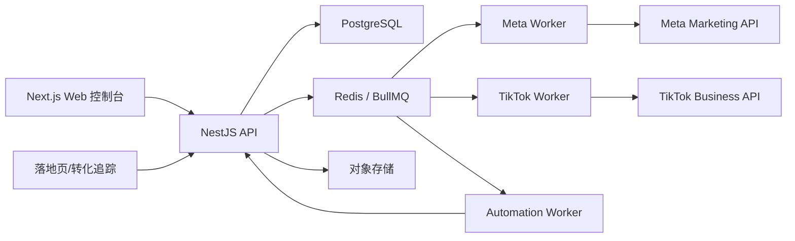

# TikTok + Facebook 一键投放系统开发计划

## 1. 项目定位

本项目定位为跨平台广告投放运营中台，第一阶段聚焦 TikTok Ads 与 Meta/Facebook Ads 的统一管理、一键创建广告、固定规则自动化、数据看板和团队协作。

第一阶段暂不接入 AI 自动优化，先使用固定策略模板和规则引擎实现稳定、可控的自动化。后续再在文案生成、素材建议、预算优化建议、异常诊断等模块接入 AI。

## 2. 核心目标

### 2.1 MVP 目标

- 支持注册申请、后台审核开通，审核通过后账号才能正式登录使用。
- 支持邮箱登录、员工号登录、忘记密码、账号禁用和登录锁定。
- 支持用户管理、员工号管理、角色权限和数据权限。
- 支持 Meta/Facebook 与 TikTok 广告账号授权。
- 支持统一管理广告账户、主页、Pixel、Business Center 等核心资产。
- 支持创建固定投放策略模板。
- 支持管理受众、素材、文案、广告创意。
- 支持一键创建 Campaign。
- 支持 Campaign、Ad Group/Ad Set、Ad、Creative 的状态同步。
- 支持基础数据看板。
- 支持固定规则自动化，例如暂停、启动、调预算、复制广告组。
- 支持团队成员、权限和操作日志。

### 2.2 非 MVP 目标

- 暂不做 AI 自动优化。
- 暂不做复杂机器学习预测。
- 暂不做完整 CRM。
- 暂不做完整电商建站系统。
- 暂不做过重的数据仓库架构。

## 3. 推荐技术栈

### 3.1 前端

- 框架：Next.js
- 语言：TypeScript
- UI：Tailwind CSS + shadcn/ui
- 表格：TanStack Table
- 表单：React Hook Form + Zod
- 图表：ECharts 或 Recharts
- 状态管理：Zustand 或 TanStack Query
- 请求层：TanStack Query + typed API client

### 3.2 后端

- 框架：NestJS
- 语言：TypeScript
- ORM：Prisma
- 数据库：PostgreSQL
- 队列：Redis + BullMQ
- 鉴权：JWT + Refresh Token
- API 文档：Swagger/OpenAPI
- 日志：Pino
- 定时任务：BullMQ repeatable jobs 或 Nest schedule

### 3.3 存储

- 素材文件：Cloudflare R2、AWS S3、阿里云 OSS 三选一
- 临时上传：后端签名直传
- CDN：Cloudflare 或对象存储自带 CDN

### 3.4 部署

MVP 阶段可以使用：

- 前端：Vercel 或自建 Docker
- 后端：Docker + 云服务器
- 数据库：托管 PostgreSQL 或自建 PostgreSQL
- Redis：托管 Redis 或自建 Redis
- 对象存储：Cloudflare R2 或阿里云 OSS

如果后期客户和数据量增长，再升级为：

- Kubernetes 或 Docker Compose 多服务部署
- ClickHouse 报表库
- Temporal 工作流
- 独立数据同步服务

## 4. 系统架构



## 5. 数据策略

### 5.1 官方广告数据

Meta 与 TikTok 的广告表现数据可以通过官方 API 获取，例如消耗、展示、点击、转化等。  
但不建议每次打开看板都实时调用官方接口。

推荐策略：

- 本地保存广告表现缓存。
- 看板默认读取本地数据库。
- 用户点击刷新时触发官方 API 同步。
- 每 15 分钟或每小时同步当天数据。
- 每天凌晨补拉昨天和近 7 天数据，因为转化数据可能延迟。

### 5.2 必须本地存储的数据

- 用户账号
- 注册申请和审核状态
- 员工号账号
- 团队
- 角色
- 权限
- 数据权限范围
- 登录日志
- Meta/TikTok 授权 token，加密存储
- 广告账户 ID 与平台映射
- Strategy 策略模板
- Targeting 受众模板
- Creative 广告创意
- Copywriting 文案
- Media 素材
- Campaign 创建配置
- 平台 Campaign/Ad Group/Ad ID 映射
- 自动化规则
- 自动化执行日志
- 操作日志
- 素材上传记录
- 自有转化事件
- 落地页访客数据

### 5.3 可缓存的数据

- 广告日报
- 广告小时报
- Campaign 结构快照
- 广告账户余额
- 广告状态
- 审核状态
- Pixel 状态

### 5.4 后期可接入 ClickHouse 的数据

- 高粒度广告表现数据
- 访问日志
- 转化事件
- UTM 明细
- 多维报表
- 大量历史分析数据

## 6. 核心模块设计

## 6.1 账号与团队模块

这是系统的基础模块，必须作为 P0 优先开发。所有广告投放、账户授权、自动化规则和财务数据都依赖用户身份、团队归属和权限边界。

### 功能

- 用户注册申请
- 注册审核开通
- 邮箱登录
- 员工号登录
- 邮箱验证
- 忘记密码
- 登录失败锁定
- 账号禁用/启用
- 团队创建
- 成员邀请
- 员工号创建
- 员工号分配
- 成员角色管理
- 权限控制
- 数据范围控制
- 用户管理后台
- 操作日志

### 注册与审核流程

1. 用户在注册页提交邮箱、密码、姓名、联系方式、公司/团队名称等信息。
2. 系统创建用户，状态为 `pending_review`，即待审核。
3. 待审核用户不能进入正式后台，登录时只显示“账号待审核，请等待管理员开通”。
4. 超级管理员或有权限的管理员在用户管理后台查看注册申请。
5. 管理员可以审核通过、驳回、备注、分配团队、分配角色。
6. 审核通过后，用户状态变为 `active`，才能登录成功并进入后台。
7. 审核驳回后，用户状态变为 `rejected`，登录时显示驳回原因或联系客服提示。
8. 后续管理员可以将用户改为 `suspended` 或 `disabled`，禁止登录。

### 用户状态

- `pending_review`：注册后待审核，不能进入后台。
- `active`：已开通，可以正常登录。
- `rejected`：审核驳回，不能登录。
- `suspended`：临时封禁，不能登录。
- `disabled`：管理员禁用，不能登录。
- `locked`：登录失败次数过多，临时锁定。

### 登录方式

### 邮箱登录

- 面向普通用户、团队负责人、管理员。
- 使用邮箱 + 密码登录。
- 只有 `active` 状态可以登录成功。
- `pending_review`、`rejected`、`suspended`、`disabled`、`locked` 状态都不能进入后台。

### 员工号登录

- 面向内部投手、优化师、运营、财务、客服等员工。
- 员工号由管理员在后台创建，或在注册审核通过时分配。
- 建议员工号全局唯一，例如 `TF000001`，也可以支持团队前缀，例如 `TEAM01-0001`。
- 员工号登录使用员工号 + 密码。
- 员工号必须绑定一个用户、一个团队、一个角色和一组数据权限。
- 员工离职或停用时，管理员可以禁用员工号，但保留历史操作日志。

### 用户管理后台

需要单独提供“用户管理”页面，建议只对 Owner、Super Admin、Admin 开放。

功能包括：

- 待审核注册列表
- 已开通用户列表
- 员工号列表
- 审核通过
- 驳回注册
- 分配团队
- 分配角色
- 分配员工号
- 修改用户资料
- 重置密码
- 禁用账号
- 解锁账号
- 查看登录日志
- 查看操作日志
- 设置数据权限
- 转移团队 Owner

### 审核开通规则

- 注册提交后默认不自动开通。
- 管理员审核通过前，不发放完整访问 token。
- 管理员审核通过时必须选择团队和角色。
- 如果是员工账号，必须分配员工号。
- 审核、驳回、禁用、解锁都必须写入操作日志。
- 第一个系统超级管理员建议通过数据库种子或后台初始化命令创建，不能依赖公开注册自动成为管理员。

### 角色建议

- Super Admin：平台最高权限，管理所有团队和用户。
- Owner：拥有全部权限
- Admin：管理广告账户、团队成员、投放配置
- Media Buyer：创建和管理广告
- Optimizer：管理自动化规则和投放优化
- Analyst：查看报表
- Finance：查看账单和消耗
- Support：查看基础信息和协助处理账号问题

### 权限粒度

- 审核用户
- 管理员工号
- 管理角色权限
- 查看广告账户
- 管理广告账户
- 创建 Campaign
- 发布 Campaign
- 修改预算
- 暂停/启动广告
- 删除广告
- 管理素材
- 管理文案
- 管理受众
- 管理策略模板
- 管理自动化规则
- 管理 Pixel
- 查看财务
- 充值/账务操作
- 查看报表
- 导出数据
- 管理成员
- 查看操作日志

### 数据权限范围

权限不只控制“能不能操作”，还要控制“能看到哪些数据”。

建议支持以下数据范围：

- 全平台全部团队，仅 Super Admin。
- 当前团队全部数据。
- 指定广告账户。
- 指定平台，例如只看 Meta 或只看 TikTok。
- 指定 Campaign 标签。
- 指定创建者/负责人。
- 只看自己创建的数据。

### 登录安全

- 密码必须哈希存储，建议使用 Argon2 或 bcrypt。
- 登录失败连续 N 次后锁定账号。
- 支持管理员手动解锁。
- 支持 Refresh Token 轮换。
- 支持退出登录后吊销 session。
- 关键操作需要校验当前用户权限。
- 所有登录成功、登录失败、审核、禁用、改权限都写入日志。

### 登录结果规则

```text
active -> 登录成功，返回 access token 和 refresh token
pending_review -> 登录失败，提示账号待审核
rejected -> 登录失败，提示审核未通过
suspended -> 登录失败，提示账号已暂停
disabled -> 登录失败，提示账号已禁用
locked -> 登录失败，提示账号已锁定
```

## 6.2 渠道授权模块

### Meta/Facebook

需要支持：

- OAuth 授权
- 广告账户列表
- Business Manager
- Page
- Pixel
- App
- 用户权限检查
- Token 有效期检查
- 授权状态刷新

### TikTok

需要支持：

- OAuth 授权
- Advertiser
- Business Center
- TikTok App
- Catalog
- Product
- Feed
- 授权状态刷新

### 注意

所有 access token 必须加密存储。  
建议使用独立的 `integration_accounts` 表管理第三方授权。

## 6.3 广告账户模块

### 功能

- 广告账户列表
- 平台筛选
- 状态筛选
- 余额显示
- 币种显示
- 时区显示
- 绑定用户
- 绑定 Pixel/Page
- 同步广告账户信息
- 查看账户消耗
- 备注
- 标签

### 表格字段建议

- 平台
- 广告账户名称
- 广告账户 ID
- 币种
- 时区
- 余额
- 今日消耗
- 总消耗
- 状态
- Pixel
- Page
- 负责人
- 更新时间
- 备注

## 6.4 Strategy 策略模板模块

这是整个系统的一键投放核心。

### 功能

- 创建策略模板
- 复制策略模板
- 编辑策略模板
- 删除策略模板
- 按平台区分 Meta/TikTok
- 在创建 Campaign 时引用策略模板

### Meta 策略字段

- 平台
- 策略名称
- 目标 Objective
- 预算类型
- 日预算
- 总预算
- 出价策略
- CTA
- 是否开启过滤器
- 广告组数量
- 每个广告组广告数量
- 特殊广告类别
- 特殊广告国家
- 归因窗口
- 投放版位

### TikTok 策略字段

- 平台
- 策略名称
- 广告目标
- 预算类型
- 日预算
- 总预算
- 出价方式
- 优化目标
- 广告组数量
- 每组广告数量
- 投放版位
- App/Event 配置

### 固定模型示例

- Campaign 数量：1
- Ad Set/Ad Group 数量：10
- 每组广告数量：10
- 日预算：5 USD
- 目标：Sales 或 App
- CTA：Learn More 或 Download
- 受众：从 Targeting 模板选择
- 素材：从 Creative Library 选择
- 文案：使用变量模板生成

## 6.5 Targeting 受众库模块

### 功能

- 创建受众模板
- 复制受众模板
- 标签管理
- 国家/地区/城市
- 年龄
- 性别
- 兴趣
- 行为
- 设备
- 版位
- 自定义受众
- 排除受众

### 字段

- 名称
- 平台
- 国家
- 地区
- 城市
- 性别
- 最小年龄
- 最大年龄
- 兴趣
- 行为
- 设备
- 备注
- 标签

## 6.6 素材库模块

### 功能

- 图片上传
- 视频上传
- 文件夹管理
- 标签管理
- 搜索
- 排序
- 预览
- 删除
- 移动
- 重命名
- 素材使用次数统计
- 素材表现统计

### 字段

- 文件名
- 文件类型
- 文件大小
- 宽高
- 时长
- 存储地址
- 缩略图
- 标签
- 所属文件夹
- 上传者
- 创建时间

## 6.7 文案库模块

### 功能

- 创建文案
- 编辑文案
- 复制文案
- 标签管理
- 文案变量
- 使用次数统计
- 拒审率统计

### 文案变量建议

- `{country}`
- `{region}`
- `{city}`
- `{min_age}`
- `{max_age}`
- `{campaign_name}`
- `{offer_name}`
- `{month}`
- `{note}`

### 字段

- 名称
- Primary text
- Headline
- Description
- 标签
- 备注
- 来源
- 使用次数
- 拒审率

## 6.8 广告创意模块

### 功能

- 组合素材和文案
- 绑定落地页/产品
- 预览广告
- 批量打标签
- 查看表现
- 复制创意

### 字段

- 名称
- 素材
- 文案
- 标题
- 描述
- CTA
- 落地页
- 产品
- 标签
- 状态

## 6.9 Landing Page 落地页模块

### 功能

- 创建落地页记录
- 绑定域名
- 绑定产品
- 绑定文案/创意
- 自定义追踪参数
- 自定义代码
- 页面规则
- 状态管理

### 为什么需要

如果只调用官方广告数据，无法完整掌握访客行为和转化事件。  
落地页模块用于承接广告点击、追踪访问、记录事件、补充官方数据。

### 字段

- 名称
- URL
- 域名
- 产品
- 状态
- 追踪参数
- 自定义代码
- 备注

## 6.10 Offer 产品模块

### 功能

- 产品名称
- 产品链接
- 价格
- 图片
- 状态
- 是否使用 tracker
- 安全页 URL
- 备注

### 用途

- 用于广告创意绑定
- 用于落地页绑定
- 用于转化统计
- 用于 ROAS/利润计算

## 6.11 Domain 域名模块

### 功能

- 添加域名
- 验证域名
- 绑定落地页
- 绑定像素
- 域名状态
- 过期时间
- DNS 状态

MVP 可以先做简单版本，只记录域名、状态和绑定关系。

## 6.12 Campaign 一键投放模块

### 创建流程

1. 填写 Campaign 名称。
2. 选择平台。
3. 选择广告账户。
4. 选择 Strategy。
5. 选择 Targeting。
6. 选择广告创意。
7. 选择落地页/Offer。
8. 确认预算和结构。
9. 提交创建任务。
10. 后台异步调用官方 API 创建广告。
11. 记录平台返回 ID。
12. 同步创建状态。

### 状态

- Draft
- Creating
- Published
- Partially Failed
- Failed
- Paused
- Active
- Archived

### 表格字段

- ID
- 名称
- 平台
- 创建者
- 状态
- 广告账户
- 日预算
- 消耗
- 曝光
- 点击
- CTR
- CPC
- 转化
- CPA
- ROAS
- 标签
- 备注
- 创建时间

### 批量操作

- 暂停
- 启动
- 删除
- 重试发布
- 修改日预算
- 切换 Offer
- 切换落地页
- 设置优化师
- 导出数据

## 6.13 固定规则自动化模块

模块名称建议使用 Optimizer 或 Automation。

### 规则结构

```text
触发范围 + 数据区间 + 条件组 + 动作组 + 执行策略
```

### 触发范围

- 指定平台
- 指定广告账户
- 指定 Campaign
- 指定 Campaign 标签
- 指定负责人
- 指定状态

### 数据区间

- 最近 1 小时
- 最近 6 小时
- 最近 24 小时
- 今天
- 昨天
- 最近 3 天
- 最近 7 天

### 条件示例

- 消耗大于 X
- 点击大于 X
- 转化等于 0
- CPA 大于 X
- ROAS 小于 X
- CTR 小于 X
- CPC 大于 X
- 审核状态为 rejected
- 状态为 active

### 动作示例

- 暂停 Campaign
- 启动 Campaign
- 暂停 Ad Set/Ad Group
- 启动 Ad Set/Ad Group
- 设置预算为 X
- 预算增加 X%
- 预算降低 X%
- 复制广告组
- 发送提醒

### 执行策略

- 只提醒，不执行
- 自动执行
- 每条规则每天最多执行 N 次
- 同一对象冷却时间 N 分钟
- 执行前记录快照
- 执行失败自动重试

### 规则示例

```text
如果 Ad Set 最近 24 小时消耗 > 10 USD 且转化 = 0，则暂停 Ad Set。
```

```text
如果 Campaign 最近 24 小时 ROAS > 2.5 且消耗 > 20 USD，则预算增加 20%，但最高不超过 200 USD。
```

```text
如果广告审核失败，则发送提醒，不自动删除。
```

## 6.14 数据看板模块

### MVP 看板

- 总消耗
- 总曝光
- 总点击
- 总转化
- CTR
- CPC
- CPA
- ROAS
- 平台占比
- 账户消耗排行
- Campaign 表现排行
- 素材表现排行

### 筛选维度

- 日期
- 平台
- 广告账户
- Campaign
- 标签
- 创建者
- 国家
- 产品
- 落地页

### 数据来源

- 官方广告 API 同步数据
- 本地访客追踪
- 本地转化事件
- 自动化执行记录

## 6.15 追踪与转化模块

### 功能

- 生成追踪链接
- 记录访客访问
- 记录 UTM 参数
- 记录 IP
- 记录设备
- 记录浏览器
- 记录 referrer
- 记录 Campaign/Ad Group/Ad 映射
- 记录自定义事件
- 记录转化

### 事件建议

- PageView
- Click
- Lead
- Purchase
- Subscribe
- AddToCart
- CustomEvent1
- CustomEvent2
- CustomEvent3

### 注意

自有转化数据必须本地存储。  
官方广告数据只解决平台表现，不解决你自己的落地页行为和业务转化闭环。

## 6.16 通知模块

### 通知类型

- 广告创建失败
- 广告审核失败
- Token 失效
- 账户余额不足
- 自动化规则执行
- 数据同步失败
- 消耗异常
- 转化异常

### 通知方式

- 站内通知
- 邮件
- Telegram Bot，可选
- 飞书/企业微信，可选

## 7. 数据库核心模型

### 用户与团队

- `users`
- `user_profiles`
- `user_review_requests`
- `employee_accounts`
- `teams`
- `team_members`
- `roles`
- `permissions`
- `role_permissions`
- `member_permissions`
- `data_scopes`
- `login_logs`
- `sessions`
- `audit_logs`

### 授权与渠道

- `integration_accounts`
- `ad_accounts`
- `business_centers`
- `facebook_pages`
- `pixels`
- `tiktok_apps`
- `platform_assets`

### 投放资源

- `strategies`
- `targetings`
- `media_assets`
- `copywritings`
- `ad_creatives`
- `landing_pages`
- `offers`
- `domains`

### 广告对象

- `campaigns`
- `ad_groups`
- `ads`
- `creative_bindings`
- `publish_tasks`
- `platform_id_mappings`

### 报表数据

- `campaign_daily_stats`
- `ad_group_daily_stats`
- `ad_daily_stats`
- `creative_daily_stats`
- `account_daily_stats`

### 自动化

- `automation_rules`
- `automation_rule_conditions`
- `automation_rule_actions`
- `automation_executions`
- `automation_execution_logs`

### 追踪

- `tracking_links`
- `landing_page_visits`
- `conversion_events`
- `postbacks`

## 8. 后端服务拆分

### NestJS 模块

- `AuthModule`
- `UserModule`
- `UserReviewModule`
- `EmployeeAccountModule`
- `TeamModule`
- `PermissionModule`
- `IntegrationModule`
- `MetaModule`
- `TikTokModule`
- `AdAccountModule`
- `StrategyModule`
- `TargetingModule`
- `MediaModule`
- `CopywritingModule`
- `CreativeModule`
- `LandingPageModule`
- `OfferModule`
- `DomainModule`
- `CampaignModule`
- `PublisherModule`
- `ReportModule`
- `AutomationModule`
- `TrackingModule`
- `NotificationModule`
- `AuditLogModule`

## 9. 后台任务设计

### 任务队列

- `sync-meta-accounts`
- `sync-tiktok-accounts`
- `sync-campaign-structure`
- `sync-campaign-insights`
- `publish-campaign`
- `retry-publish-campaign`
- `run-automation-rule`
- `sync-account-balance`
- `refresh-token-status`
- `send-notification`

### 同步频率建议

- 广告账户信息：每 6 小时
- 当天广告数据：每 15 到 60 分钟
- 昨天广告数据：每天凌晨补拉
- 近 7 天广告数据：每天补拉一次
- Token 状态：每 12 小时
- 自动化规则：每 15 到 60 分钟，按规则配置

## 10. API 设计示例

### Auth

- `POST /auth/register`
- `POST /auth/login`
- `POST /auth/employee-login`
- `POST /auth/logout`
- `POST /auth/refresh`
- `POST /auth/forgot-password`
- `POST /auth/reset-password`
- `GET /auth/me`
- `GET /auth/sessions`
- `DELETE /auth/sessions/:id`

### User Management

- `GET /admin/users`
- `GET /admin/users/pending`
- `GET /admin/users/:id`
- `POST /admin/users/:id/approve`
- `POST /admin/users/:id/reject`
- `POST /admin/users/:id/suspend`
- `POST /admin/users/:id/enable`
- `POST /admin/users/:id/disable`
- `POST /admin/users/:id/unlock`
- `POST /admin/users/:id/reset-password`
- `PATCH /admin/users/:id/role`
- `PATCH /admin/users/:id/data-scope`
- `GET /admin/users/:id/login-logs`
- `GET /admin/users/:id/audit-logs`

### Employee Accounts

- `GET /admin/employees`
- `POST /admin/employees`
- `GET /admin/employees/:id`
- `PATCH /admin/employees/:id`
- `POST /admin/employees/:id/enable`
- `POST /admin/employees/:id/disable`
- `POST /admin/employees/:id/reset-password`

### Integrations

- `GET /integrations`
- `GET /integrations/meta/oauth-url`
- `GET /integrations/tiktok/oauth-url`
- `POST /integrations/meta/callback`
- `POST /integrations/tiktok/callback`
- `POST /integrations/:id/refresh`

### Campaign

- `GET /campaigns`
- `POST /campaigns`
- `GET /campaigns/:id`
- `POST /campaigns/:id/publish`
- `POST /campaigns/:id/pause`
- `POST /campaigns/:id/start`
- `POST /campaigns/bulk-action`
- `GET /campaigns/:id/stats`

### Strategy

- `GET /strategies`
- `POST /strategies`
- `GET /strategies/:id`
- `PATCH /strategies/:id`
- `POST /strategies/:id/clone`
- `DELETE /strategies/:id`

### Automation

- `GET /automation-rules`
- `POST /automation-rules`
- `PATCH /automation-rules/:id`
- `POST /automation-rules/:id/run`
- `GET /automation-executions`

### Reports

- `GET /reports/overview`
- `GET /reports/campaigns`
- `GET /reports/ad-groups`
- `GET /reports/ads`
- `GET /reports/creatives`
- `POST /reports/sync`

## 11. 前端页面规划

### 基础页面

- 登录
- 员工号登录
- 注册
- 注册提交成功/待审核提示页
- 审核驳回提示页
- 忘记密码
- 团队切换
- 用户管理
- 注册审核
- 员工号管理
- 角色权限管理
- 数据权限管理
- 登录日志
- 成员管理
- 个人设置

### 控制台

- 总览 Dashboard
- 平台消耗
- 今日数据
- 账户状态
- 自动化日志
- 最近失败任务

### 渠道

- Meta 授权
- TikTok 授权
- 广告账户
- Page
- Pixel
- Business Center
- TikTok Advertiser

### 资源

- Strategy
- Targeting
- Landing Page
- Offer
- Domain

### 素材

- 素材库
- 文案库
- 广告创意

### 广告系列

- Campaign 列表
- Campaign 创建
- Campaign 详情
- Ad Group/Ad Set 列表
- Ad 列表
- 批量操作

### 自动化

- 规则列表
- 创建规则
- 执行日志
- 规则执行详情

### 报表

- 总览报表
- Campaign 报表
- 广告账户报表
- 创意报表
- 落地页访客
- 转化事件

## 12. UI 设计原则

- 做运营后台，不做营销落地页。
- 信息密度要高。
- 表格是核心，不要过度卡片化。
- 所有列表支持搜索、筛选、排序、字段显示控制。
- 关键页面支持批量操作。
- 创建 Campaign 使用分区表单。
- 危险操作需要二次确认。
- 所有投放动作写入操作日志。
- 所有异步任务显示状态。

## 13. 开发阶段

## 阶段 0：项目初始化，预计 3 到 5 天

### 任务

- 初始化 monorepo
- 配置 Next.js
- 配置 NestJS
- 配置 Prisma
- 配置 PostgreSQL
- 配置 Redis/BullMQ
- 配置 ESLint/Prettier
- 配置基础 Docker
- 配置环境变量

### 交付

- 项目基础结构可运行
- 前后端可本地启动
- 数据库迁移可执行
- 健康检查接口可访问

## 阶段 1：账号、团队、审核、员工号、权限，预计 2 周

### 任务

- 注册申请
- 注册提交后待审核状态
- 用户审核通过/驳回
- 用户登录
- 员工号登录
- 忘记密码
- 登录失败锁定
- 账号禁用/启用
- JWT 鉴权
- 团队模型
- 成员邀请
- 员工号创建和分配
- 角色权限
- 数据权限
- 登录日志
- 操作日志

### 交付

- 新用户注册后进入待审核状态，不能直接登录后台
- 管理员可以在用户管理后台审核通过或驳回注册申请
- 审核通过的用户可以用邮箱登录后台
- 员工可以用员工号登录后台
- 被驳回、禁用、暂停、锁定的账号不能进入后台
- 用户可以创建和进入团队
- Owner 可以邀请成员
- Owner/Admin 可以创建员工号并分配角色
- 不同角色看到不同操作入口
- 不同数据权限只能看到对应广告账户、Campaign 或团队数据

## 阶段 2：渠道授权与广告账户，预计 2 周

### 任务

- Meta OAuth
- TikTok OAuth
- 保存加密 token
- 拉取广告账户
- 拉取 Pixel/Page/Business Center
- 拉取 TikTok Advertiser/Business Center
- Token 状态检测

### 交付

- 用户可以连接 Meta
- 用户可以连接 TikTok
- 可以看到广告账户列表
- 可以同步广告账户状态

## 阶段 3：资源库，预计 2 到 3 周

### 任务

- Strategy 策略模板
- Targeting 受众库
- 素材库上传
- 文案库
- 广告创意
- Offer
- Landing Page

### 交付

- 可以创建完整投放所需资源
- 可以复用策略、受众、素材、文案
- 可以组合广告创意

## 阶段 4：一键创建 Campaign，预计 3 周

### 任务

- Campaign 创建表单
- 创建任务队列
- Meta Campaign 发布
- Meta Ad Set 发布
- Meta Creative 发布
- Meta Ad 发布
- TikTok Campaign 发布
- TikTok Ad Group 发布
- TikTok Ad 发布
- 发布失败重试
- 平台 ID 映射

### 交付

- 用户可以通过统一表单创建广告
- 后台异步发布到 Meta/TikTok
- 发布状态可追踪
- 失败原因可查看
- 可以重试发布

## 阶段 5：数据同步和看板，预计 2 周

### 任务

- 同步 Campaign 结构
- 同步广告表现
- 日报表落库
- 看板接口
- Campaign 列表指标
- 报表筛选
- 手动刷新

### 交付

- 看板显示消耗、曝光、点击、转化等指标
- Campaign 列表显示核心表现
- 用户可以按平台、账户、日期筛选

## 阶段 6：固定规则自动化，预计 2 周

### 任务

- 自动化规则模型
- 条件配置器
- 动作配置器
- 自动化执行器
- 冷却时间
- 执行日志
- 只提醒模式
- 自动执行模式

### 交付

- 用户可以创建规则
- 系统可以定时判断规则
- 系统可以执行暂停、启动、调预算等动作
- 所有执行动作可追溯

## 阶段 7：追踪与转化，预计 2 到 3 周

### 任务

- 追踪链接生成
- 访客记录
- UTM 解析
- 自定义事件上报
- 转化事件记录
- Campaign/Ad 映射
- 访客报表
- 转化报表

### 交付

- 可以记录落地页访问
- 可以记录转化事件
- 可以将转化关联到广告对象

## 阶段 8：稳定性与上线，预计 1 到 2 周

### 任务

- 错误日志
- 监控
- 权限检查
- API 限流
- 队列重试
- 数据备份
- 安全检查
- 部署脚本
- 用户验收测试

### 交付

- MVP 可上线试用
- 核心流程稳定
- 有基础监控和日志

## 14. 建议时间线

如果 1 到 2 个全栈开发：

- 可用 MVP：10 到 14 周
- 带自动化规则的稳定版本：14 到 18 周
- 带追踪和转化闭环的版本：18 到 22 周

如果 3 到 4 人团队：

- 可用 MVP：6 到 8 周
- 带自动化规则的稳定版本：9 到 12 周
- 带追踪和转化闭环的版本：12 到 16 周

## 15. 优先级

### P0

- 登录与团队
- Meta/TikTok 授权
- 广告账户管理
- Strategy
- Targeting
- 素材库
- 文案库
- 一键创建 Campaign
- 数据同步
- Campaign 列表
- 操作日志

### P1

- 自动化规则
- Landing Page
- Offer
- 转化追踪
- 高级筛选
- 批量操作
- 失败重试
- 通知

### P2

- 域名管理
- PWA
- 店铺
- Newsletter
- Referral
- AI Copilot
- ClickHouse
- 复杂归因模型

## 16. 安全与合规

### Token 安全

- access token 加密存储
- refresh token 加密存储
- 不在日志输出 token
- 不在前端暴露 token
- 定期检查 token 状态

### 操作安全

- 改预算、暂停、删除必须写操作日志
- 批量操作需要二次确认
- 自动化规则需要冷却时间
- 自动化规则默认先只提醒
- 重要操作支持回滚记录

### API 限流

- 按用户限流
- 按团队限流
- 按平台账号限流
- 官方 API 错误需要指数退避
- 批量同步需要分片

## 17. 风险点

### 官方 API 审核与权限

Meta 和 TikTok 的 API 权限可能限制创建广告、读取数据或管理资产。  
需要尽早验证开发者账号权限是否覆盖实际投放流程。

### API 版本变化

Meta Marketing API 版本更新较快。  
后端必须设计平台适配层，避免业务代码直接耦合官方字段。

### 数据延迟

广告转化数据可能延迟。  
报表需要支持补拉最近 7 天数据。

### 自动化误操作

自动暂停和自动加预算存在风险。  
MVP 建议自动化规则先默认只提醒，确认稳定后再允许自动执行。

### 多平台字段不一致

Meta 与 TikTok 的 Campaign、Ad Group、Creative、指标字段不完全一致。  
需要设计统一模型，同时保留平台原始数据。

## 18. 验收标准

### MVP 验收

- 用户可以提交注册申请。
- 注册后账号默认为待审核，不能直接进入后台。
- 管理员可以审核通过或驳回注册申请。
- 审核通过后用户可以用邮箱登录系统。
- 员工可以用员工号登录系统。
- 管理员可以禁用、启用、解锁用户。
- 管理员可以分配角色和数据权限。
- 用户可以连接 Meta 和 TikTok。
- 用户可以看到广告账户。
- 用户可以创建 Strategy。
- 用户可以创建 Targeting。
- 用户可以上传素材。
- 用户可以创建文案。
- 用户可以创建广告创意。
- 用户可以通过统一表单创建 Campaign。
- 系统可以异步发布广告。
- 系统可以显示发布状态。
- 系统可以同步广告表现数据。
- 看板可以显示核心指标。
- 所有关键操作有日志。

### 自动化验收

- 用户可以创建规则。
- 规则可以按计划执行。
- 规则可以筛选 Campaign/Ad Group。
- 规则可以判断指标条件。
- 规则可以发送提醒。
- 规则可以执行暂停、启动、调预算。
- 规则执行有日志。
- 同一对象有冷却时间保护。

### 数据验收

- 当天数据可以定时同步。
- 近 7 天数据可以补拉。
- Campaign 列表指标和官方后台基本一致。
- 报表支持日期、平台、账户筛选。
- 手动刷新可以触发同步。

## 19. 后期 AI 接入方向

AI 不作为第一阶段核心，但需要预留扩展点。

### 可接入场景

- 文案生成
- 标题生成
- 素材角度建议
- 受众推荐
- Campaign 诊断
- 异常解释
- 自动化规则建议
- 周报生成

### 接入原则

- AI 先给建议，不直接执行。
- 预算、暂停、删除等动作需要人工确认。
- AI 输出必须记录来源和上下文。
- AI 建议需要和实际数据闭环评估。

## 20. 推荐项目结构

```text
1toufang/
  apps/
    web/
      src/
        app/
        components/
        features/
        lib/
    api/
      src/
        modules/
        common/
        jobs/
        integrations/
  packages/
    shared/
      src/
        types/
        schemas/
        constants/
    database/
      prisma/
        schema.prisma
  docker/
  docs/
  .env.example
  package.json
  pnpm-workspace.yaml
```

## 21. 第一周建议行动清单

1. 初始化 monorepo。
2. 确定 PostgreSQL 表设计第一版。
3. 跑通 NestJS + Prisma + Redis。
4. 跑通 Next.js 登录页面。
5. 创建 Meta/TikTok OAuth 配置页。
6. 验证开发者账号 API 权限。
7. 设计 Strategy 创建表单。
8. 设计 Campaign 创建流程图。

## 22. 最终建议

第一阶段最关键的不是 AI，而是以下五件事：

1. Strategy 策略模板。
2. Targeting 受众库。
3. Creative 素材与文案组合。
4. Campaign 异步发布任务。
5. Automation 固定规则执行器。

只要这五个模块打稳，后面接 AI、做高级报表、做更复杂的数据归因都会顺很多。
